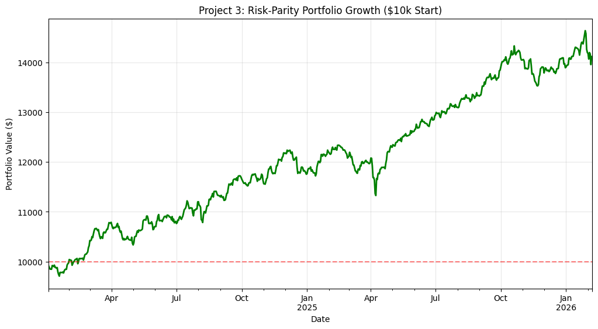

# Quantitative Asset Research (2025)

This repository contains professional-grade financial models developed to analyze market risk and algorithmic trading strategies.

## Project 1: Multi-Asset Correlation Analysis
* **Goal:** Use Pearson Correlation to identify diversification benefits across US Equities, Aussie Equities, Gold, and Crypto.
* **Math:** Calculated Log-Returns to ensure statistical stationarity.
* **Result:** Successfully mapped the decoupling of BTC-USD from traditional safe-havens like Gold in late 2025.

## Project 2: Apple (AAPL) Momentum Strategy
* **Methodology:** Developed a 50/200-day Simple Moving Average (SMA) crossover backtest.
* **Risk Metrics:** Achieved an **Annualized Sharpe Ratio of 0.86**.
* **Drawdown:** Identified a **Maximum Drawdown of -24.58%**, highlighting the strategy's volatility during market shifts.

## Project 3: Risk-Parity Engine (Diversified Fund)
* **Goal:** Solve the high drawdown issues found in Project 1.
* **Math Strategy:** Used **Inverse Volatility Weighting** ($1/\sigma$) to equalize risk across SPY, VAS.AX, Gold, and Bitcoin.

### Project 3 Final Audit
* **Total Return:** 40.99%
* **Max Drawdown:** -3.66% (Extremely low risk)
* **Sharpe Ratio:** 1.61 (Professional grade risk-adjusted return)
* **Logic:** Proved that Inverse-Volatility weighting can capture Bitcoin's upside while using Bonds/Gold to crush the downside.

## Project 4: Institutional Risk Engine (VaR/CVaR & Monte Carlo)

**The Problem:** Traditional performance metrics (Sharpe Ratio) assume a "Normal Distribution," ignoring "Fat Tail" risks in volatile assets like Crypto and Tech.
**The Solution:** A multi-model audit engine quantifying the true "Risk of Ruin" using live market data.

---

### 1. Volatility & Tail Risk Analysis
Calculates the "Kill Switch" for the portfolio—identifying how deep a crash goes beyond the typical daily move.

| Metric | Result | Interpretation |
| :--- | :--- | :--- |
| **Daily VaR (95%)** | `-2.17%` | Max expected loss on a typical bad day. |
| **Daily CVaR (95%)** | `-3.30%` | Average loss during an actual market crash. |

---

### 2. Monte Carlo Simulation (10,000 Paths)
Projecting 10,000 "Alternative Futures" over the next 252 trading days to determine the probability of ending the year in a loss.

| Metric | Result |
| :--- | :--- |
| **Prob. of being "In the Red"** | `19.97%` |
| **Worst Case Scenario (0.1%)** | `$5,638.50` |

---

### 3. Deterministic Stress Testing
Manual shocks applied to the portfolio to simulate specific historical "Black Swan" events.

| Scenario | Portfolio Impact |
| :--- | :--- |
| **2020 COVID Crash** | `-12.45%` |
| **Crypto Winter** | `-18.20%` |
| **2022 Tech Meltdown** | `-6.15%` |

---

### 🔗 Project Access
* **Codebase:** [View Notebook](./04_Risk_Modeling/Risk_Modeling.ipynb)
* **Interactive:** [Open in Google Colab](https://colab.research.google.com/github/RyanSVargas/Quant-Finance-Research/blob/main/04_Risk_Modeling/Risk_Modeling.ipynb)

#### Monte Carlo Simulation (10,000 Paths)

### 🔗 Project Access
* **Codebase:** [View Notebook](./04_Risk_Modeling/Risk_Modeling.ipynb)
* **Interactive:** [Open in Google Colab](https://colab.research.google.com/github/RyanSVargas/Quant-Finance-Research/blob/main/04_Risk_Modeling/Risk_Modeling.ipynb)

## Project 5: Alpha Generation & Factor Attribution

**The Problem:** Is the portfolio actually "outperforming," or is it just riding a bull market?
**The Solution:** Applied a **Fama-French 3-Factor Model** to isolate Alpha from Beta, Size, and Value tilts.

### 📈 Factor Audit Results
* **Monthly Alpha:** `+3.21%` (p=0.006) — Statistically significant edge.
* **Market Beta:** `1.81` — High-sensitivity growth profile.
* **R-Squared:** `0.538` — Significant portion of returns driven by specific asset selection.

