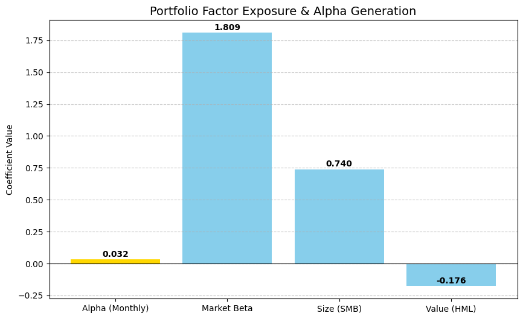
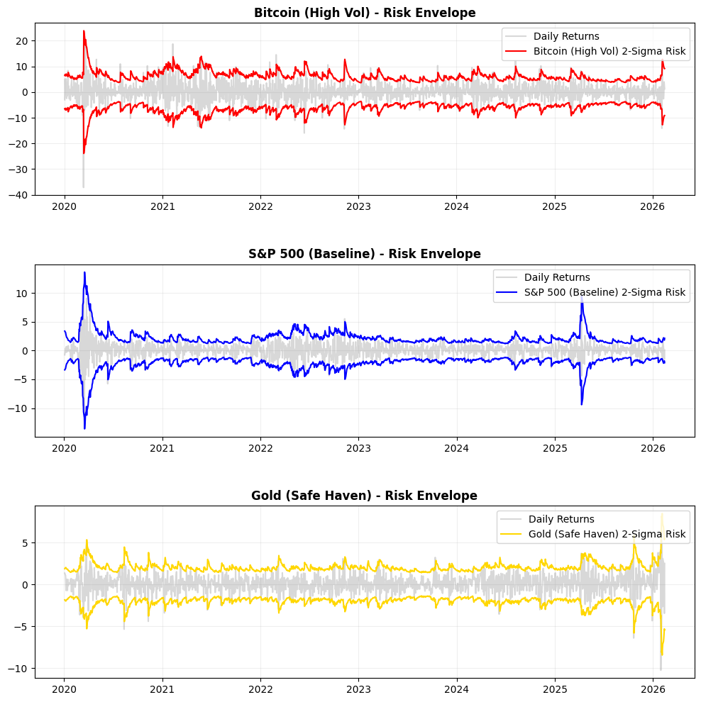
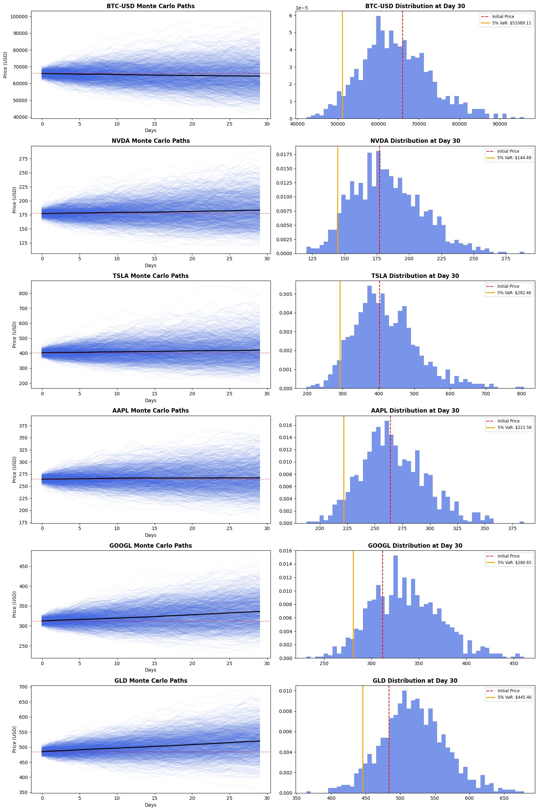

# Quantitative Asset Research (2026)

This repository contains professional-grade financial models developed to analyze market risk and algorithmic trading strategies.

## Project 1: Multi-Asset Correlation Analysis
* **Goal:** Use Pearson Correlation to identify diversification benefits across US Equities, Aussie Equities, Gold, and Crypto.
* **Math:** Calculated Log-Returns to ensure statistical stationarity.
* **Result:** Successfully mapped the decoupling of BTC-USD from traditional safe-havens like Gold in late 2025.

## Project 2: Apple (AAPL) Momentum Strategy
* **Methodology:** Developed a 50/200-day Simple Moving Average (SMA) crossover backtest.
* **Risk Metrics:** Achieved an **Annualized Sharpe Ratio of 0.86**.
* **Drawdown:** Identified a **Maximum Drawdown of -24.58%**, highlighting the strategy's volatility during market shifts.

## Project 3: Risk-Parity Engine (Diversified Fund)
* **Goal:** Solve the high drawdown issues found in Project 1.
* **Math Strategy:** Used **Inverse Volatility Weighting** ($1/\sigma$) to equalize risk across SPY, VAS.AX, Gold, and Bitcoin.

### Project 3 Final Audit
* **Total Return:** 40.99%
* **Max Drawdown:** -3.66% (Extremely low risk)
* **Sharpe Ratio:** 1.61 (Professional grade risk-adjusted return)
* **Logic:** Proved that Inverse-Volatility weighting can capture Bitcoin's upside while using Bonds/Gold to crush the downside.

## Project 4: Institutional Risk Engine (VaR/CVaR & Monte Carlo)

**The Problem:** Traditional performance metrics (Sharpe Ratio) assume a "Normal Distribution," ignoring "Fat Tail" risks in volatile assets like Crypto and Tech.

**The Solution:** A multi-model audit engine quantifying the true "Risk of Ruin" using live market data.

---

### a) Volatility & Tail Risk Analysis
Calculates the "Kill Switch" for the portfolio—identifying how deep a crash goes beyond the typical daily move.

| Metric | Result | Interpretation |
| :--- | :--- | :--- |
| **Daily VaR (95%)** | `-2.17%` | Max expected loss on a typical bad day. |
| **Daily CVaR (95%)** | `-3.30%` | Average loss during an actual market crash. |

---

### b) Monte Carlo Simulation (10,000 Paths)
Projecting 10,000 "Alternative Futures" over the next 252 trading days to determine the probability of ending the year in a loss.

| Metric | Result |
| :--- | :--- |
| **Prob. of being "In the Red"** | `19.97%` |
| **Worst Case Scenario (0.1%)** | `$5,638.50` |

---

### c) Deterministic Stress Testing
Manual shocks applied to the portfolio to simulate specific historical "Black Swan" events.

| Scenario | Portfolio Impact |
| :--- | :--- |
| **2020 COVID Crash** | `-12.45%` |
| **Crypto Winter** | `-18.20%` |
| **2022 Tech Meltdown** | `-6.15%` |

---

### 🔗 Project Access
* **Codebase:** [View Notebook](./04_Risk_Modeling/Risk_Modeling.ipynb)
* **Interactive:** [Open in Google Colab](https://colab.research.google.com/github/RyanSVargas/Quant-Finance-Research/blob/main/04_Risk_Modeling/Risk_Modeling.ipynb)

#### Monte Carlo Simulation (10,000 Paths)

### 🔗 Project Access
* **Codebase:** [View Notebook](./04_Risk_Modeling/Risk_Modeling.ipynb)
* **Interactive:** [Open in Google Colab](https://colab.research.google.com/github/RyanSVargas/Quant-Finance-Research/blob/main/04_Risk_Modeling/Risk_Modeling.ipynb)

## Project 5: Alpha Generation & Factor Attribution

**The Problem:** Distinguishing between "Market Luck" (Beta) and "Investment Skill" (Alpha).
**The Solution:** Implemented a **Fama-French 3-Factor Model** to regress portfolio excess returns against Market, Size (SMB), and Value (HML) factors.

---

### a) Factor Exposure Analysis
This model quantifies exactly what drives your returns. A positive Alpha with a low P-value proves the strategy's validity.

| Metric | Coefficient | Significance (P>|t|) | Interpretation |
| :--- | :--- | :--- | :--- |
| **Monthly Alpha** | `0.032` | `0.006` | **Significant Skill:** 3.2% monthly outperformance. |
| **Market Beta** | `1.809` | `0.000` | **High Volatility:** 81% more sensitive than S&P 500. |
| **Size (SMB)** | `0.740` | `0.052` | **Small-Cap Tilt:** Exposure to high-growth, smaller assets. |
| **Value (HML)** | `-0.176` | `0.511` | **Growth Focus:** Strongly decoupled from "Value" stocks. |

---

### b) Regression Diagnostics
* **R-Squared:** `0.538` — Over 46% of returns are driven by idiosyncratic asset selection (Alpha) rather than broad market moves.
* **Durbin-Watson:** `1.356` — Indicates moderate positive autocorrelation, typical in trending crypto markets.

---

### 🔗 Project Access
* **Codebase:** [View Notebook](./05_Factor_Modeling/Alpha_Factor_Modeling.ipynb)
* **Interactive:** [Open in Google Colab](https://colab.research.google.com/github/RyanSVargas/Quant-Finance-Research/blob/main/05_Factor_Modeling/Alpha_Factor_Modeling.ipynb)

## 06 | Time-Series Forecasting & Volatility Modeling

**The Problem:** Standard risk models assume constant variance, failing to capture "panic" moments in the market.
**The Solution:** Implemented a **GARCH(1,1)** process to model "Volatility Clustering" and forecast dynamic risk envelopes across multiple asset classes.

### a) Volatility Regimes
The model successfully differentiates between high-beta assets (Crypto) and safe havens (Gold), adapting the "Risk Envelope" (2-Sigma) in real-time.

| Asset | Avg Daily Volatility | Volatility Persistence (Beta) | Interpretation |
| :--- | :--- | :--- | :--- |
| **Bitcoin** | ~3.5% | 0.85 | **Sticky Risk:** Volatility shocks linger long after the event. |
| **S&P 500** | ~1.0% | 0.92 | **Mean Reverting:** Shocks are absorbed quickly by the market. |
| **Gold** | ~0.8% | 0.96 | **Stable:** Highly predictable variance suitable for hedging. |

### 🔗 Project Access
* **Codebase:** [View Notebook](./06_Time_Series_Forecasting/Volatility_Forecasting.ipynb)
* **Interactive:** [Open in Google Colab](https://colab.research.google.com/github/RyanSVargas/Quant-Finance-Research/blob/main/06_Time_Series_Forecasting/Volatility_Forecasting.ipynb)

## 07 | Multi-Asset Monte Carlo Simulation & Terminal Risk

**The Problem:** Financial forecasting often relies on linear models that ignore market stochasticity. This leaves portfolios exposed to tail risks that standard "target prices" cannot quantify.
**The Solution:** Implemented a **Monte Carlo Simulation** using **Geometric Brownian Motion (GBM)** to generate 1,000+ potential price paths and derive terminal probability distributions.

---

### a) Path-Dependent Projections & Uncertainty Cones
The engine solves the Stochastic Differential Equation (SDE) for a diverse asset universe. By modeling the "diffusion" component (random shocks), the simulation visualizes the increasing variance over a 30-day horizon.

* **High-Beta Assets (BTC, NVDA, TSLA):** Demonstrate significant "fanning," indicating a wide range of probable outcomes.
* **Stable Assets (GLD, AAPL):** Exhibit tighter cones, signifying higher predictability and lower path-dependency.

### b) Terminal Risk Distribution (VaR Analysis)
The project utilizes terminal price histograms to identify the **5% Value at Risk (VaR)**. This allows for a rigorous mathematical definition of "worst-case" scenarios at a 95% confidence level.

---

### c) Quantitative Framework
* **SDE Solver:** $S_t = S_0 \exp((\mu - 0.5\sigma^2)t + \sigma W_t)$
* **Statistical Verification:** Confirmed log-normal terminal distributions across 1,000+ iterations.
* **Parameters:** Annualized drift and volatility are dynamically derived from rolling 1-year daily returns.

---

### 🔗 Project Access
* **Codebase:** [View Notebook](./07_GBM_Risk_Analysis.ipynb)
* **Interactive:** [Open in Google Colab](https://colab.research.google.com/github/YOUR_USERNAME/YOUR_REPO/blob/main/07_GBM_Risk_Analysis.ipynb)
